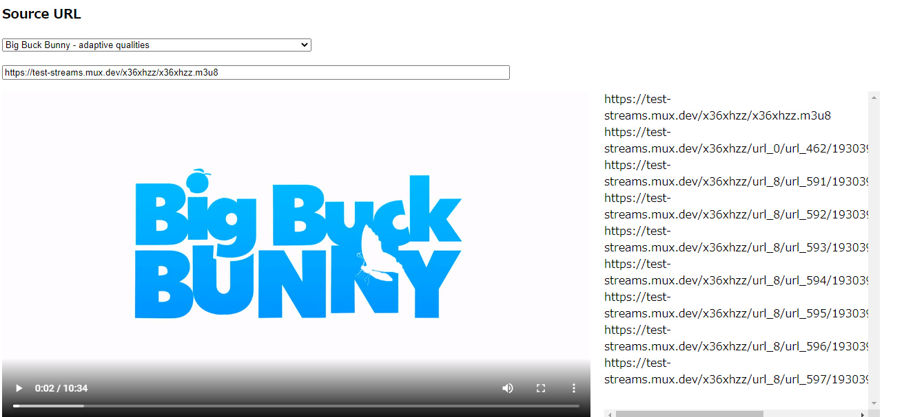
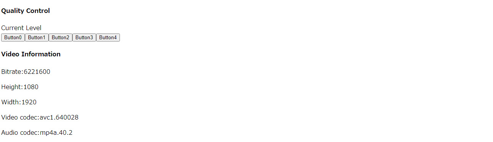

# hls.js mini project
 Web Player that allows for playback of HTTP Live Streaming. Realized with hls.js – a JavaScript library that implements an HLS Client and relies on HTML5 video tag as well as MSE (MediaSource Extension). 

Allows for successful HLS playback 
(Big buck bunny, ARTE,Chine ABR) 
Contains a predefined list of 2 HLS playlists 

Buttons for manual switch between bitrates

Displays basic information about the video (bitrate, height, width, video/audio codec)

 
[DEMO](https://sho373.github.io/hls.js-miniproject/micro-project/videos/)

